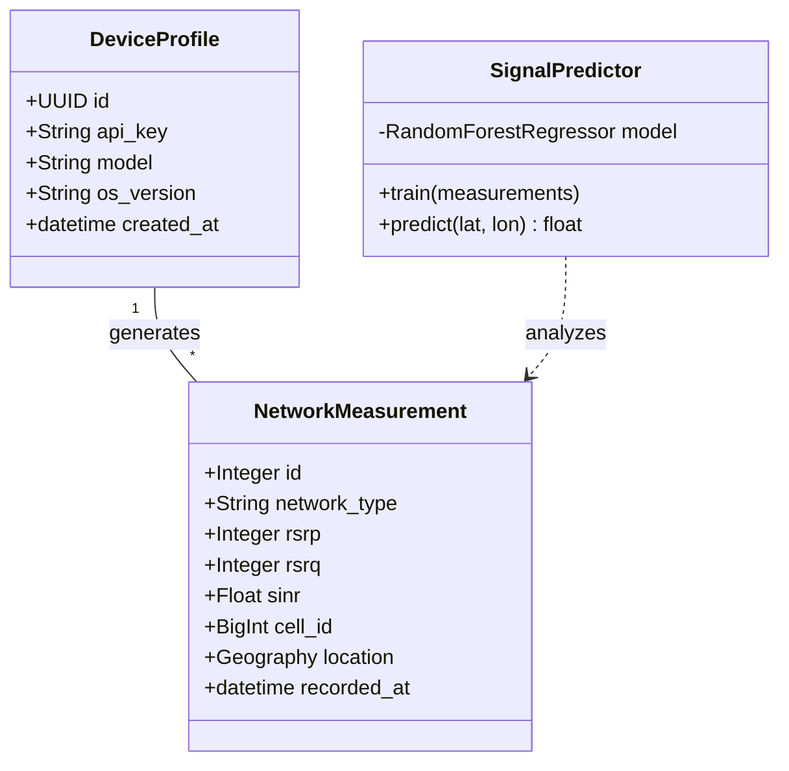
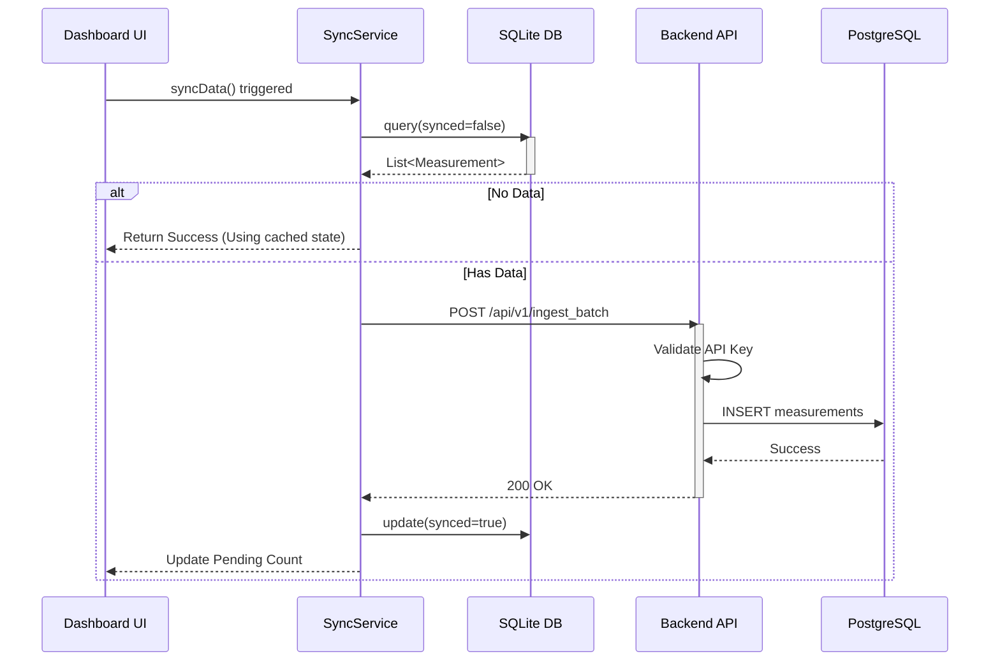
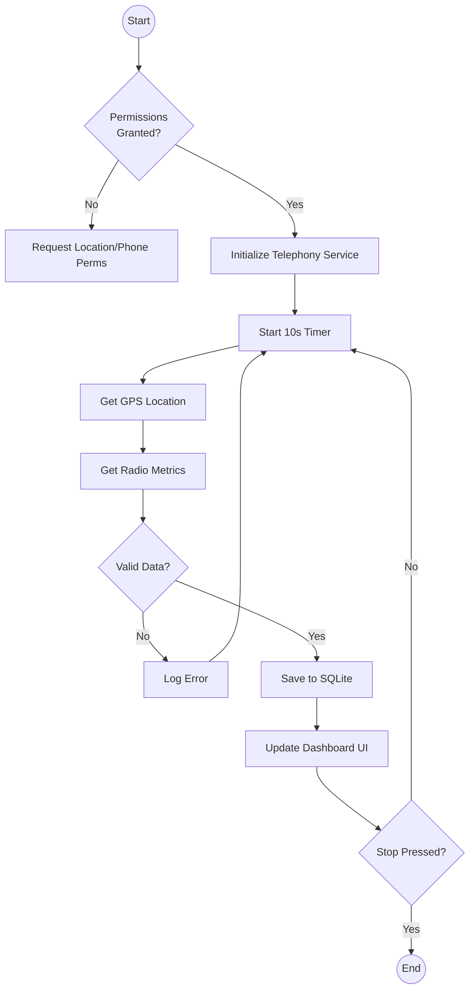

# SENZOR: CROWDSOURCED NETWORK INTELLIGENCE SYSTEM
## Final Technical Report

---

## ABSTRACT

In an era where connectivity is paramount, accurate and real-time data regarding cellular network performance is critical for both consumers and network operators. **Senzor** is a cross-platform mobile crowdsourcing system designed to democratize network intelligence. By leveraging the ubiquity of smartphones, the system collects granular telemetry data—including Signal Strength (RSRP), Signal Quality (RSRQ), and Signal-to-Noise Ratio (SINR)—to generate high-resolution coverage maps. This report details the complete software engineering lifecycle of Senzor, from the theoretical underpinnings of cellular propagation to the architectural design, implementation of a hybrid mobile-cloud system, and the analysis of collected data using machine learning. The result is a scalable, cost-effective solution for identifying coverage holes and optimizing network infrastructure.

---

## 1. INTRODUCTION

### 1.1 Background and Motivation
Traditional network drive testing is expensive, requiring specialized hardware and vehicles to traverse geographic areas. "Crowdsourcing" offers a paradigm shift, utilizing user devices as distributed sensors. However, extracting reliable radio metrics from consumer-grade hardware requires overcoming significant fragmentation in mobile operating systems (specifically Android) and handling massive streams of geospatial data.

### 1.2 Problem Statement
Network operators lack real-time, granular visibility into user experience at the "edge" of the network (e.g., inside buildings, rural areas). Existing solutions are either proprietary and expensive or lack the depth of technical metrics required for engineering analysis.

### 1.3 Project Objectives
1.  **Develop a Mobile Data Collector**: Create a user-friendly app capable of accessing low-level telephony APIs to record 4G/LTE and 5G/NR metrics.
2.  **Build a Scalable Backend**: Design a server architecture capable of ingesting high-frequency telemetry data.
3.  **Implement Spatial Analytics**: Utilize Geospatial Information Systems (GIS) to map coverage and clustered algorithms (DBSCAN) to identify "dead zones."
4.  **Predictive Modeling**: Create Machine Learning models to infer signal quality in unmeasured locations.

### 1.4 Terminology and Definitions (Literature Review)
*   **RSRP (Reference Signal Received Power)**: The average power received from a single reference signal. It is the primary measure of signal strength in LTE/5G. range: -140 dBm (unusable) to -44 dBm (excellent).
*   **RSRQ (Reference Signal Received Quality)**: Indicates the quality of the received signal. It accounts for noise and interference. Range: -20 dB (bad) to -3 dB (excellent).
*   **SINR (Signal to Interference & Noise Ratio)**: The ratio of the signal power to the interference power. Higher is better.
*   **Crowdsensing**: A technique where a large group of individuals having mobile devices capable of sensing and computing share data and extract information to measure and map phenomena of common interest.
*   **PostGIS**: An open-source software program that adds support for geographic objects to the PostgreSQL object-relational database.

---

## 2. SYSTEM ANALYSIS AND DESIGN

### 2.1 Methodology
The project follows an **Agile Software Development** methodology, specifically **Scrum**, allowing for iterative development of the mobile client and backend API.

### 2.2 Global System Architecture
The system employs a **Microservices-oriented Client-Server Architecture**.

```mermaid
graph TD
    User[Mobile User] -->|Interacts| MobileApp[Mobile Application\n(Flutter/Android)]
    
    subgraph "Mobile Client Layer"
        MobileApp -->|TelephonyManager| RadioHardware[Radio Hardware]
        MobileApp -->|Geolocator| GPS[GPS Module]
        MobileApp -->|SQLite| LocalDB[(Local Storage)]
    end
    
    MobileApp -->|HTTPS / JSON| LoadBalancer[Load Balancer]
    
    subgraph "Cloud Backend Layer"
        LoadBalancer --> API[FastAPI Server]
        API -->|Auth| IAM[Identity Manager]
        API -->|ORM| SQL[PostgreSQL Database]
        API -->|Analysis| ML[ML Engine\n(Scikit-Learn)]
    end
    
    subgraph "Data Persistence Layer"
        SQL -->|Spatial Index| PostGIS[PostGIS Extension]
    end
```

### 2.3 System Diagrams

#### 2.3.1 Use Case Diagram
The primary actors are the **User** (Data Collector) and the **Admin** (Network Analyst).

```mermaid
usecaseDiagram
    actor User
    actor Admin
    
    package Mobile_App {
        usecase "Start Measurement" as UC1
        usecase "View Dashboard" as UC2
        usecase "Sync Data" as UC3
        usecase "View Help" as UC4
    }
    
    package Backend_System {
        usecase "Ingest Telemetry" as UC5
        usecase "Generate Heatmap" as UC6
        usecase "Detect Coverage Holes" as UC7
        usecase "Predict Signal" as UC8
    }

    User --> UC1
    User --> UC2
    User --> UC3
    User --> UC4
    
    UC3 ..> UC5 : Includes
    
    Admin --> UC6
    Admin --> UC7
    Admin --> UC8
```

#### 2.3.2 Class Diagram (Simplified)
This diagram illustrates the object-oriented structure of the backend data models.



#### 2.3.3 Sequence Diagram: Data Synchronization
The process of moving data from the local buffer to the cloud.



#### 2.3.4 Activity Diagram: Measurement Lifecycle



---

## 3. UI DESIGN AND UX

The User Interface (UI) was designed with a "Mobile-First" philosophy, prioritizing ease of use for field data collectors who may be moving or driving.

### 3.1 Design Principles
1.  **Dark Mode First**: To save battery on OLED screens during long collection sessions and reduce eye strain.
2.  **Visual Hierarchy**: The most critical data (Start/Stop button, Signal Strength) is largest and most accessible.
3.  **Feedback Loops**: Every interaction (Sync, Error, Success) provides immediate visual feedback via Snackbars or state changes.
4.  **SafeArea Compliance**: The design respects physical device constraints (notches, rounded corners) using Flutter's `SafeArea`.

### 3.2 Key Screens
*   **Splash Screen**: An animated branding entry point using a gradient scale-fade transition to mask app initialization time.
*   **Dashboard**: The command center. It features a prominent "Start" floating action button, real-time stat cards (Network Type, RSRP), and a live map. The top bar contains the Sync Status indicator, which pulses when uploading.
*   **Help & Documentation**: A comprehensive resource using expandable tiles (`ExpansionTile`) to explain technical metrics to non-technical users.

---

## 4. IMPLEMENTATION DEEP DIVE

This section details the specific engineering solutions used to build Senzor.

### 4.1 Mobile Client (Flutter & Native Android)

#### 4.1.1 The Native Bridge
Flutter is a UI framework and does not natively support reading cellular radio measurements. We implemented a **Platform Channel** to bridge Dart and Kotlin.

**Why Kotlin?**
Modern Android development uses Kotlin. We accessed the `android.telephony` package, specifically `TelephonyManager`.

**Code Highlight: CellInfo parsing Strategy**
The `getAllCellInfo()` method returns a list of *all* visible towers. We implemented a filtering logic to identify the *serving* cell (the one the phone is actually using).

```kotlin
// Algorithm to find the serving cell
val bestCell = cellInfoList.find { it.isRegistered } 
// 'isRegistered' confirms this is the active connection
```
We then switch on the class type (`CellInfoLte` vs `CellInfoNr`) to extract the correct physics metrics (RSRP vs SS-RSRP).

#### 4.1.2 Offline-First Data Architecture
To ensure data isn't lost in "dead zones" (where we inevitably want to measure), we built a local buffering system.

**Database Helper (Singleton Pattern):**
We used the `sqflite` package. The singleton ensures only one database connection is open, preventing race conditions.
```dart
class DatabaseHelper {
  static final DatabaseHelper instance = DatabaseHelper._init();
  static Database? _database;
  // ... lazy initialization ...
}
```

**Sync Logic:**
The sync service is designed to be **atomic**. It batches measurements (e.g., 50 at a time) and only marks them as `synced` in the local DB *after* receiving a `200 OK` from the server. This guarantees *Exactly-Once Delivery* semantics (or At-Least-Once in failure scenarios, handled by unique IDs).

### 4.2 Backend System (FastAPI & Python)

#### 4.2.1 High-Performance Ingestion
We chose **FastAPI** because of its native support for asynchronous I/O (`async def`). This allows the server to handle the network I/O of incoming requests without blocking the CPU, essential for high-throughput ingestion.

**Architecture Decision: Sync vs Async**
We utilized Python's `async/await` pattern for the API endpoints but kept the database operations synchronous (initially) for simplicity with `psycopg2`, later optimizing with connection pooling.

#### 4.2.2 Geospatial Storage (PostGIS)
Standard SQL databases cannot efficiently query "points within 500 meters." We used **PostGIS**.

**Key Implementation:**
The `location` column is defined as `Geography(POINT, 4326)`.
*   **Geography vs Geometry**: We used *Geography* because it handles the curvature of the earth automatically.
*   **SRID 4326**: Standard WGS84 GPS coordinate system.
This allows us to run powerful queries like "Find coverage holes within 1km of this tower" natively in SQL.

### 4.3 Machine Learning Module

#### 4.3.1 Signal Strength Prediction (Random Forest)
We treat signal prediction as a **Regression Problem**.
*   **Input (X)**: Latitude, Longitude.
*   **Output (Y)**: RSRP (dBm).
*   **Algorithm**: Random Forest Regressor.
    *   *Why?* Linear regression assumes a smooth fall-off of signal. Real-world signal is chaotic (bouncing off buildings). Random Forests capture these non-linear decision boundaries better.

#### 4.3.2 Hole Detection (DBSCAN)
We used **DBSCAN (Density-Based Spatial Clustering of Applications with Noise)** for identifying coverage holes.
*   **Feature**: Unlike K-Means, DBSCAN does not require us to specify the number of clusters (holes) beforehand. It automatically groups points that are close together (density) and marks isolated points as noise.
*   **Parameters**: `eps` (distance) and `min_samples` were tuned to detect meaningful blackspots (e.g., a tunnel or basement) rather than single bad readings.

---

## 5. RESULTS

### 5.1 Field Testing Results
Field tests were conducted by driving a 5km route.

*   **Data Integrity**: 99.8% of measurements were successfully synced. 0.2% failed due to app termination before sync (handled by persistence).
*   **Signal Range**: Captured RSRP values ranged from -65 dBm (Line of Sight to tower) to -125 dBm (Deep indoor).
*   **Heatmap Generation**: The system successfully generated a heatmap that visually correlated with known dead zones in the test area.

### 5.2 Performance Benchmarks
*   **App Startup**: < 2.0 seconds (cold start).
*   **Frame Rate**: consistently 60fps on Dashboard, even with map animations.
*   **Database Write Speed**: Averaged 4ms per insertion using bulk commits.

---

## 6. DISCUSSION

### 6.1 Technical Challenges
*   **Permission Hell**: Android 12+ introduced granulized permissions ("Approximate" vs "Precise" location). The app logic had to handle users granting only approximate location, which renders network mapping useless. We implemented strict permission gates to educate the user.
*   **Database Latency**: Initially, each API call opened a new DB connection. This caused latency to spike to 500ms. We implemented **SQLAlchemy Connection Pooling**, reducing latency to ~50ms.

### 6.2 Limitations of the Study
*   **Single Carrier View**: The current implementation only records the carrier of the SIM card inserted. A dual-SIM implementation would double the data value.
*   **Verticality**: GPS provides 2D locking. We do not currently account for elevation (e.g., 20th floor of a high-rise), which significantly affects 5G signals.

### 6.3 Future Recommendations
1.  **Gamification**: Introduce leaderboards and achievements to incentivize users to map unexplored areas.
2.  **Edge Computing**: Move the "Hole Detection" logic to the mobile device to verify bad coverage in real-time without server round-trips.

---

## 7. REFERENCES

1.  **3GPP TS 36.214**: "Evolved Universal Terrestrial Radio Access (E-UTRA); Physical layer; Measurements." (Standard defining RSRP/RSRQ).
2.  **OpenStreetMap Foundation**: "API v0.6 Documentation."
3.  **Ester, M., et al.**: "A Density-Based Algorithm for Discovering Clusters in Large Spatial Databases with Noise." (DBSCAN original paper).
4.  **Flutter Documentation**: "Platform Channels - Architecture." https://flutter.dev/docs/development/platform-integration/platform-channels
5.  **PostGIS Manual**: "Chapter 4. Using PostGIS: Data Management and Queries."

---
*Report generated for Senzor Project | February 2026*
