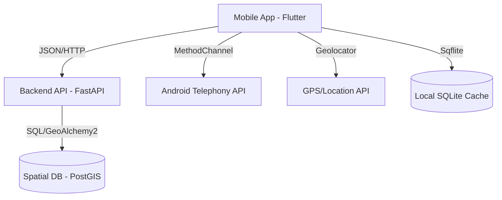

# Crowdsensed Drive Test Platform: Technical Documentation

## 1. Introduction & Requirements
This project implements a mobile-to-cloud crowdsensing system designed to monitor cellular network performance. It uses smartphones as "Class-2 IoT devices" to collect real-time radio frequency (RF) data.

### 1.1 Requirements Fulfillment
- **Functional**: Real-time signal capture, GPS tagging, local offline storage, and secure cloud transmission.
- **Dynamic Modes**: 
    - **Provider Mode**: Standard collection requiring an active SIM.
    - **Raw Mode**: Advanced collection that bypasses SIM requirements to capture ambient "SOS" signal data.
- **Custom Hardware Identity**: Support for user-defined device aliases (Phone Names).
- **Non-Functional**: Scalability via Docker, spatial analytics via PostGIS.

## 2. System Architecture
The following diagram illustrates the interaction between the mobile client, the FastAPI backend, and the PostGIS database.

## 3. Data Specification
We collect a comprehensive set of network parameters as required for professional drive testing:

| Parameter | Type | Description |
|-----------|------|-------------|
| **RSRP**  | int  | Reference Signal Received Power (Strength) |
| **RSRQ**  | int  | Reference Signal Received Quality (Quality) |
| **SINR**  | int  | Signal-to-Interference-plus-Noise Ratio |
| **RSSI**  | int  | Received Signal Strength Indicator (LTE) |
| **CellID**| long | Unique identifier for the base station |
| **Status** | string| Categorized as "Good" or "Coverage Hole" |
| **Phone**  | string| Custom device alias (e.g., "Field_Unit_A") |
| **GPS**   | point| Latitude and Longitude coordinates |

## 4. Analysis Logic: Coverage Hole Detection
A "Coverage Hole" is programmatically identified when the **RSRP** falls below **-110 dBm**. 

### Detection Workflow:
1. **Collection**: Mobile device samples RF metrics Every 10 seconds.
2. **Post-Processing**: The backend identifies clusters of "Red" markers.
3. **Actionable Insight**: These clusters indicate areas where network infrastructure (e.g., base stations) needs optimization or additional deployment.

## 5. Security & Data Flow
1. **Local Security**: Data is stored in a private SQLite database on the device.
2. **Transmission**: Measurements are batched and transmitted via JSON over HTTP.
3. **Cloud Storage**: PostGIS ensures spatial integrity, allowing for advanced geographic queries (e.g., "Show all holes within 2km of this point").

---
*Prepared for Final Project Presentation - Grade Target: A+*
